# 📈 Rossmann SalesIQ — AI-Powered Store Sales Forecasting using Facebook Prophet

> Predicting **daily store sales** for Rossmann — one of Europe's largest drug store chains — using **Facebook Prophet (Time-Series Forecasting)** with holiday effects, enabling HR & Operations teams to plan staffing, 
inventory, and promotions **weeks in advance**.

<p align="center">
  
  
  
  
  
  
</p>

---

## 🧩 The Business Problem

<p align="center">
  
</p>

Rossmann operates **3,000+ drug stores across 7 European countries**. Store managers are currently responsible for predicting their own daily sales — but these predictions are often inaccurate because they don't account for promotions, competition, school/state holidays, seasonality, or long-term trends.

<p align="center">
  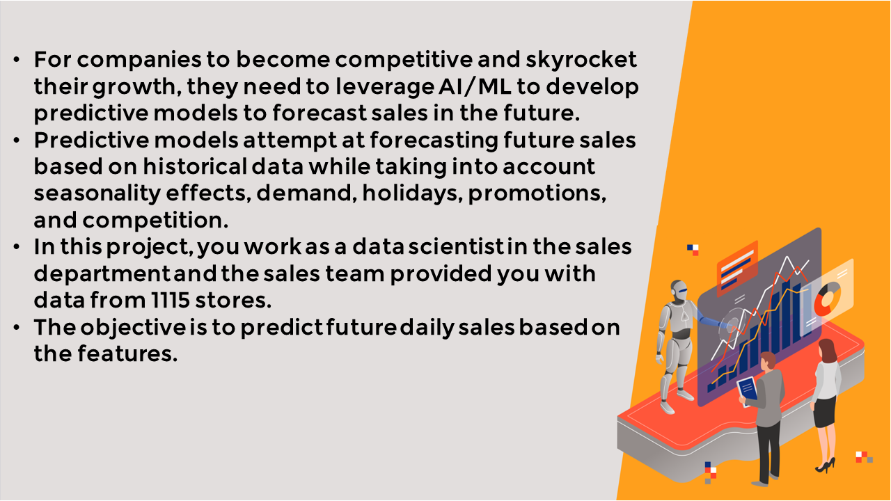
</p>

> 💭 *"What if we could build an AI-powered system that predicts daily store sales weeks in advance — accounting for holidays, promotions, and seasonal trends — enabling smarter HR and inventory decisions?"*

<p align="center">
  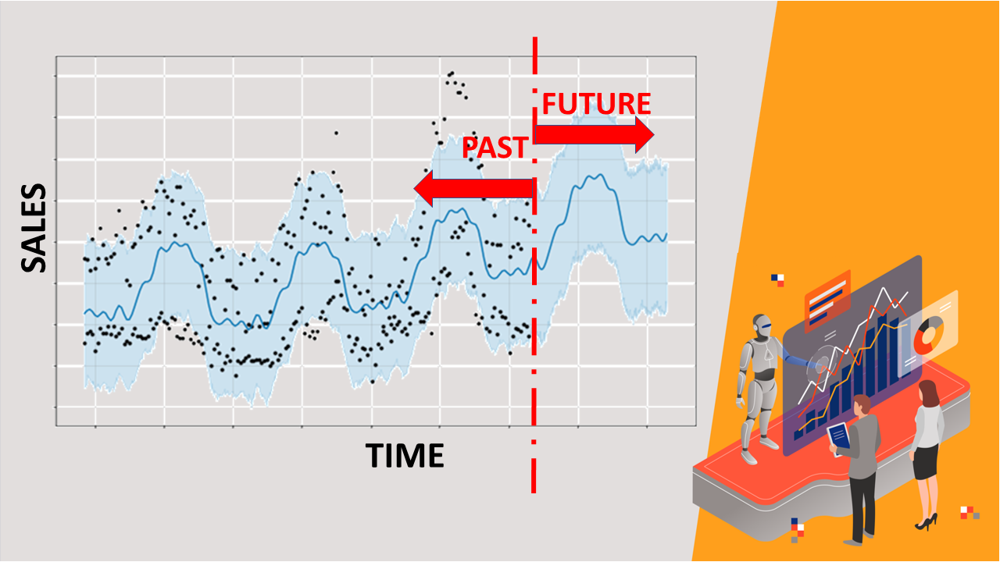
</p>

**The Case Study:** As a **Data Science Consultant** hired by Rossmann's HR & Operations department, the goal is to build an accurate, scalable forecasting system that can predict sales for any of the **1,115 stores** and help managers plan staffing and stock levels proactively.

<p align="center">
  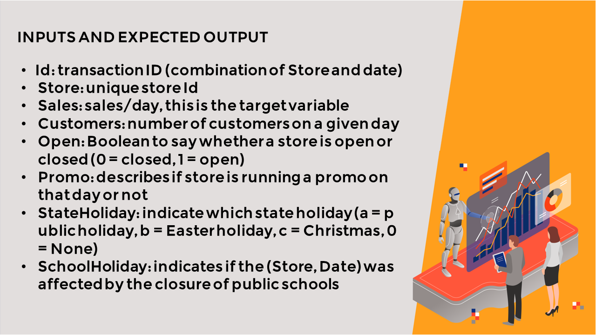
</p>

<p align="center">
  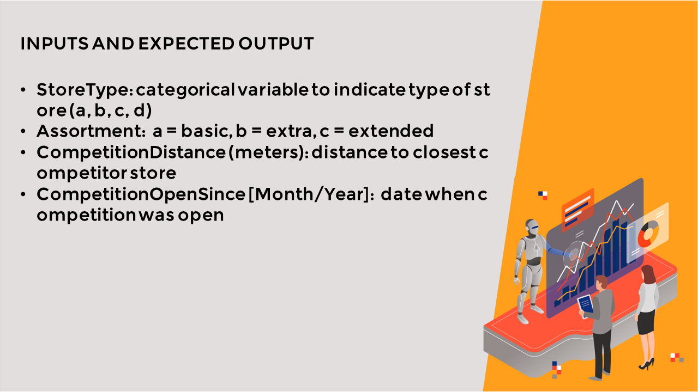
</p>

<p align="center">
  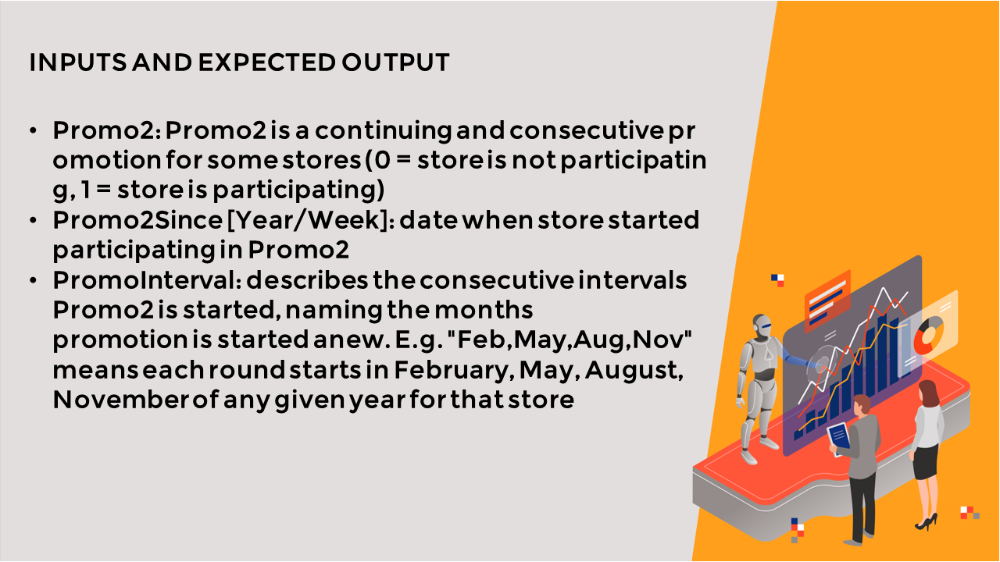
</p>

---

## 📁 Project Structure

```
📦 Rossmann_Sales_Forecasting_Prophet
 ┣ 📓 Rossmann_Sales_Forecasting_Prophet.ipynb  # Full end-to-end notebook
 ┣ 📄 train.csv                               # ~1 million rows of daily store sales (2013–2015)
 ┣ 📄 store.csv                               # Metadata for all 1,115 Rossmann stores
 ┣ 🖼️ 1.png                                   # Project slide 1 — Business case
 ┣ 🖼️ 2.png                                   # Project slide 2 — Why forecasting matters
 ┣ 🖼️ 3.png                                   # Project slide 3 — Case study brief
 ┣ 🖼️ 4.png                                   # Project slide 4 — Dataset overview
 ┣ 🖼️ 5.png                                   # Project slide 5 — Data features
 ┣ 🖼️ 6.png                                   # Project slide 6 — Prophet model overview
 ┣ 📁 images/                                 # All visualization plots extracted from notebook
 │   ┣ 🖼️ missing_data_sales.png             # Missing data heatmap — sales training data
 │   ┣ 🖼️ histograms_sales.png               # Feature distribution histograms — sales data
 │   ┣ 🖼️ missing_data_store.png             # Missing data heatmap — store info (before)
 │   ┣ 🖼️ missing_data_store_after.png       # Missing data heatmap — store info (after)
 │   ┣ 🖼️ store_histograms.png               # Feature distribution histograms — store data
 │   ┣ 🖼️ correlation_heatmap.png            # Correlation heatmap — merged dataset
 │   ┣ 🖼️ sales_customers_per_month.png      # Sales & customers grouped by month
 │   ┣ 🖼️ sales_customers_per_month_2.png    # Sales & customers per month (view 2)
 │   ┣ 🖼️ sales_customers_per_day.png        # Sales & customers by day of month
 │   ┣ 🖼️ sales_customers_per_day_2.png      # Sales & customers by day of month (view 2)
 │   ┣ 🖼️ sales_customers_per_weekday.png    # Sales & customers by day of week
 │   ┣ 🖼️ sales_customers_per_weekday_2.png  # Sales & customers by day of week (view 2)
 │   ┣ 🖼️ sales_by_store_type.png            # Sales over time by store type
 │   ┣ 🖼️ promo_sales_barplot.png            # Promotion effect on sales — bar plot
 │   ┣ 🖼️ promo_sales_violinplot.png         # Promotion effect on sales — violin plot
 │   ┣ 🖼️ forecast_plot.png                  # Prophet base forecast — Store 10 (60 days)
 │   ┣ 🖼️ forecast_components.png            # Prophet base forecast components
 │   ┣ 🖼️ holiday_forecast_plot.png          # Holiday-enhanced forecast — Store 6 (90 days)
 │   ┗ 🖼️ holiday_forecast_components.png    # Holiday-enhanced forecast components
 ┗ 📄 README.md                               # This file
```

---

## 📊 About the Dataset

Two datasets were used in this project — both sourced from a real-world **Kaggle competition** hosted by Rossmann.

| Dataset | Source |
|---------|--------|
| `train.csv` | [Rossmann Store Sales — Kaggle](https://www.kaggle.com/c/rossmann-store-sales) |
| `store.csv` | [Rossmann Store Sales — Kaggle](https://www.kaggle.com/c/rossmann-store-sales) |

### 🛒 train.csv — Sales Training Data

| Property | Value |
|----------|-------|
| **Total Rows** | ~1,017,209 rows |
| **Stores Covered** | 1,115 stores |
| **Date Range** | January 2013 — July 2015 |
| **Target Variable** | `Sales` (daily sales in €) |

| Column | Description |
|--------|-------------|
| `Store` | Unique store ID (1–1115) |
| `DayOfWeek` | Day of the week (1=Mon, 7=Sun) |
| `Date` | Date of the sales record |
| `Sales` | Daily turnover in EUR (target variable) |
| `Customers` | Number of customers on that day |
| `Open` | 1 = store open, 0 = store closed |
| `Promo` | 1 = store running a promotion that day |
| `StateHoliday` | a=Public holiday, b=Easter, c=Christmas, 0=None |
| `SchoolHoliday` | 1 = schools closed on that date |

### 🏬 store.csv — Store Metadata

| Column | Description |
|--------|-------------|
| `StoreType` | Store model type (a, b, c, d) |
| `Assortment` | Product assortment level (a=basic, b=extra, c=extended) |
| `CompetitionDistance` | Distance to nearest competitor store (meters) |
| `Promo2` | 1 = store participates in continuous promotion |
| `Promo2SinceWeek/Year` | When the store joined the Promo2 promotion |

---

## 🎯 Objectives

| Goal | Description |
|------|-------------|
| 🔍 Explore | Perform deep EDA on sales data, store metadata, and merged datasets |
| 📅 Analyze | Discover how promotions, holidays, and weekdays impact daily sales |
| 🏗️ Build | Build a Facebook Prophet model for per-store daily sales forecasting |
| 🎓 Enhance | Improve model accuracy by adding real-world school & state holiday effects |
| 📈 Forecast | Generate 60–90 day sales forecasts for any store |
| 👥 Impact | Enable HR to plan staffing, inventory & promotions based on predictions |

---

## 🧠 ML Pipeline

```
📥 Load Data (train.csv — ~1M rows, store.csv — 1,115 stores)
  ↓
🔎 Explore Sales Training Data (shape, dtypes, null values, distributions)
  ↓
🔎 Explore Store Metadata (store types, assortment levels, competition)
  ↓
🔗 Merge Both Datasets (on Store ID)
  ↓
🔎 Explore Merged Dataset
  │   ├── Sales by DayOfWeek
  │   ├── Sales by Promo
  │   ├── Sales by StateHoliday
  │   ├── Sales by StoreType
  │   └── Sales trends over time
  ↓
🏗️ Build Base Forecasting Model (Task 4)
  │   ├── Filter data for a single store
  │   ├── Format: ds (date) + y (sales)
  │   ├── Fit Prophet model
  │   ├── Generate future dataframe (60 days)
  │   └── Visualize forecast + components
  ↓
🎓 Enhance Model with Holiday Effects (Task 5)
  │   ├── Extract School Holidays from dataset
  │   ├── Extract State Holidays (Public, Easter, Christmas)
  │   ├── Concatenate into Prophet-compatible holiday dataframe
  │   └── Re-train model with holidays included
  ↓
📊 Visualize Final Predictions (with holiday-aware forecasts)
  ↓
⚡ Final Output: Scalable Sales Forecasting System for all 1,115 stores
```

---

## ⚙️ Model — Facebook Prophet

```python
from prophet import Prophet

# Prepare data for Prophet (requires 'ds' and 'y' columns)
store_df = sales_train_all_df[sales_train_all_df['Store'] == store_id][['Date', 'Sales']]
store_df.columns = ['ds', 'y']

# Base model
model = Prophet()
model.fit(store_df)

# Forecast 60 days into the future
future = model.make_future_dataframe(periods=60)
forecast = model.predict(future)

# Plot forecast and components
model.plot(forecast)
model.plot_components(forecast)
```

### Holiday-Enhanced Model

```python
# Define school holidays
school_holidays = pd.DataFrame({
    'holiday': 'school_holiday',
    'ds': pd.to_datetime(school_holiday_dates),
    'lower_window': 0,
    'upper_window': 1
})

# Define state holidays (public, Easter, Christmas)
state_holidays = pd.DataFrame({
    'holiday': 'state_holiday',
    'ds': pd.to_datetime(state_holiday_dates),
    'lower_window': 0,
    'upper_window': 1
})

# Combine holidays
all_holidays = pd.concat([school_holidays, state_holidays])

# Enhanced model with holidays
model = Prophet(holidays=all_holidays)
model.fit(store_df)
```

### How Prophet Decomposes the Forecast

| Component | What it captures |
|-----------|-----------------|
| **Trend** | Long-term sales growth or decline over years |
| **Weekly Seasonality** | Which days of the week have higher/lower sales |
| **Yearly Seasonality** | Seasonal patterns across months of the year |
| **Holiday Effects** | Impact of school closures, public holidays, Christmas, Easter |

---

## 💡 Key Insights from EDA

| Insight | What It Means |
|---------|---------------|
| 🎯 **Promotions significantly boost sales** | Stores running promos on a given day sell noticeably more |
| 📅 **Sales drop on Sundays & closed days** | Day of week is a very strong predictor of sales |
| 🎄 **Holidays cause sharp dips or spikes** | Holiday-aware models are significantly more accurate |
| 📈 **Sales trend upward over 2013–2015** | Rossmann stores showed overall multi-year growth |
| 🏬 **Store type strongly affects sales** | Type B stores consistently outperform other types |
| 🛒 **Assortment level matters** | Extended assortment stores generate more revenue |
| 📍 **Competition distance has mild impact** | Nearby competitors slightly reduce daily sales |

---

## 📊 Tasks Completed

| Task | Description | Status |
|------|-------------|--------|
| Task 1 | Understand the Problem Statement & Business Case | ✅ Done |
| Task 2 | Import Libraries and Load Datasets | ✅ Done |
| Task 2.1 | Import & inspect Sales Training Data | ✅ Done |
| Task 2.2 | Import & inspect Store Information Data | ✅ Done |
| Task 3 | Exploratory Data Analysis (EDA) | ✅ Done |
| Task 3.1 | Explore Sales Training Data | ✅ Done |
| Task 3.2 | Explore Store Information Data | ✅ Done |
| Task 3.3 | Explore Merged Dataset | ✅ Done |
| Task 4 | Train Base Prophet Forecasting Model | ✅ Done |
| Task 5 | Enhance Model with School & State Holiday Effects | ✅ Done |

---

## 🌍 Real-World Business Impact

By deploying this forecasting system, Rossmann can:

| Department | How They Benefit |
|-----------|-----------------|
| 👥 **HR & Staffing** | Schedule the right number of employees on high-sales days, avoid overstaffing on slow days |
| 📦 **Supply Chain** | Order the right amount of stock before demand peaks — reduce waste and stockouts |
| 💰 **Finance** | Accurately budget and set revenue targets per store per quarter |
| 🎯 **Marketing** | Plan promotional campaigns around predicted low-sales periods to maximize lift |
| 🏗️ **Operations** | Proactively plan store hours, deliveries, and maintenance during predicted low periods |

---

## 🛠️ Tech Stack

| Tool / Library | Purpose |
|----------------|---------|
| **Python** | Core programming language |
| **Facebook Prophet** | Time-series forecasting model |
| **Pandas** | Data loading, cleaning, and transformation |
| **NumPy** | Numerical operations |
| **Matplotlib / Seaborn** | Data visualization and EDA plots |
| **Jupyter Notebook** | Interactive development environment |

---

## 🚀 Run This Project

```bash
# Clone the repository
git clone https://github.com/yourusername/Rossmann_Sales_Forecasting_Prophet.git
cd Rossmann_Sales_Forecasting_Prophet

# Install dependencies
pip install prophet pandas numpy matplotlib seaborn jupyter

# Launch the notebook
jupyter notebook Rossmann_Sales_Forecasting_Prophet.ipynb
```

> **Note:** Place `train.csv` and `store.csv` in the same directory as the notebook before running.
> The notebook contains preloaded outputs — you can read through it without re-running all cells.

---

## 📊 Visualization Plots

### 1️⃣ Correlation Heatmap

<p align="center">
  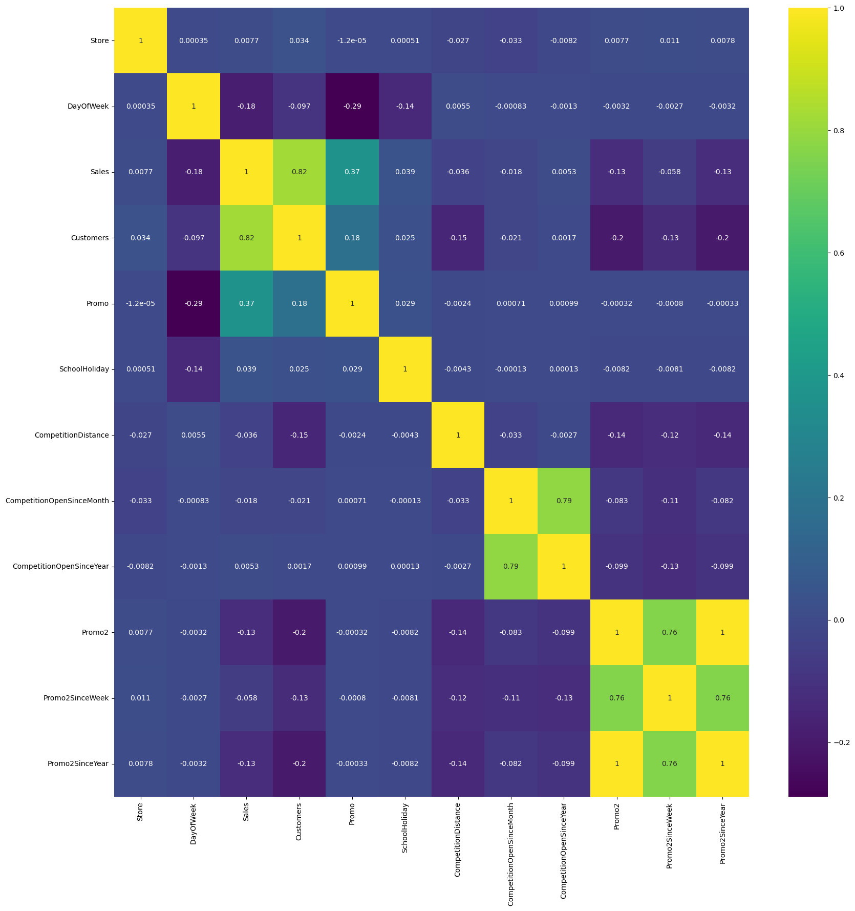
</p>
<p align="center"><em>Correlation matrix across all numeric features of the merged dataset — reveals key relationships between Sales, Customers, Promo, and store attributes</em></p>

---

### 2️⃣ Sales Over Time by Store Type

<p align="center">
  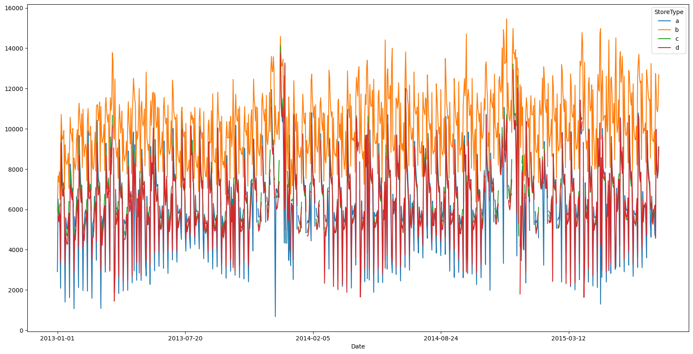
</p>
<p align="center"><em>Daily average sales across all store types (a, b, c, d) plotted over 2013–2015 — Type B stores consistently outperform all other store types</em></p>

---

### 3️⃣ Sales & Customers by Day of Week

<p align="center">
  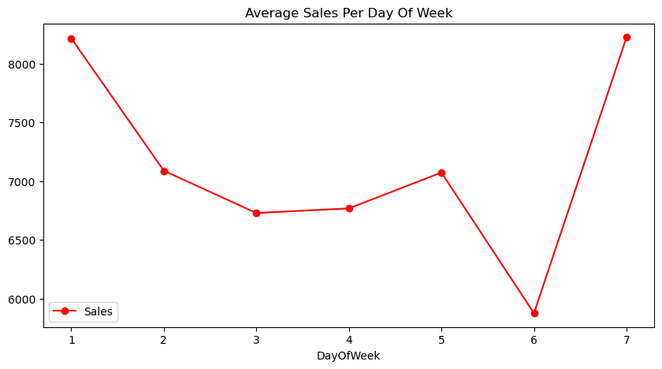
</p>
<p align="center"><em>Sales and customer volumes by day of week (1=Monday, 7=Sunday) — Monday and Saturday are the highest-traffic days; Sunday sees near-zero activity</em></p>

---

### 4️⃣ Effect of Promotions on Sales (Bar Plot)

<p align="center">
  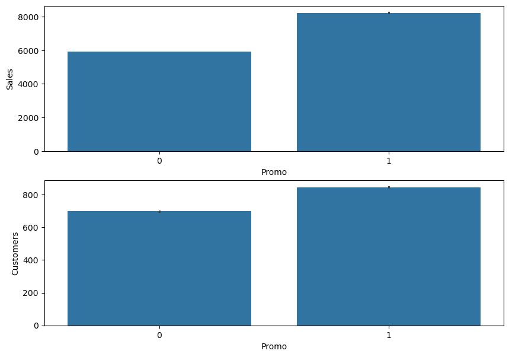
</p>
<p align="center"><em>Average Sales and Customers when Promo=0 vs Promo=1 — promotions drive a significant and measurable uplift in both revenue and footfall</em></p>

---

### 5️⃣ Effect of Promotions on Sales (Violin Plot)

<p align="center">
  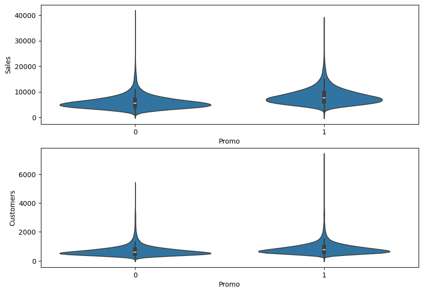
</p>
<p align="center"><em>Distribution of Sales and Customers split by promotion status — promo days show a wider, higher-value distribution confirming the strong promo effect</em></p>

---

### 6️⃣ Prophet Base Model — Sales Forecast (Store 10, 60 Days)

<p align="center">
  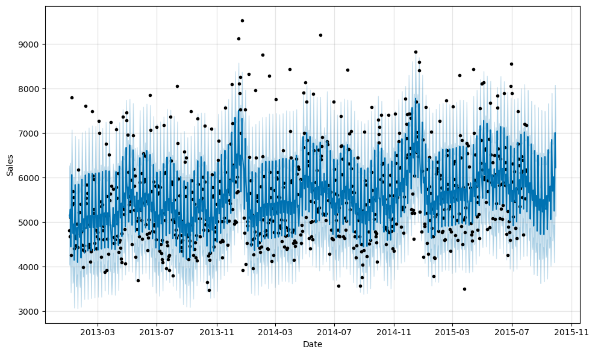
</p>
<p align="center"><em>Facebook Prophet base model sales forecast for Store 10 — 60 days into the future. Black dots = actual sales, blue line = predicted trend, shaded band = uncertainty interval</em></p>

---

### 7️⃣ Holiday-Enhanced Model — Sales Forecast (Store 6, 90 Days)

<p align="center">
  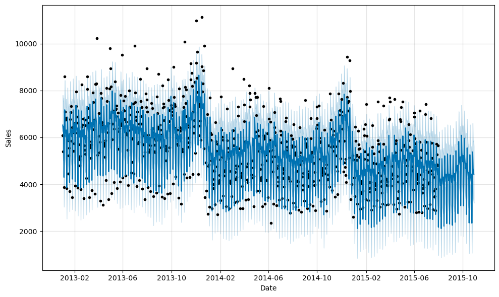
</p>
<p align="center"><em>Holiday-aware Prophet model forecast for Store 6 — 90 days ahead, with school and state holidays (Easter, Christmas, Public holidays) factored in for more accurate predictions</em></p>

---

## 📝 Conclusion

> This project demonstrates that **time-series forecasting with Facebook Prophet** can be a game-changer for retail operations. By combining **1 million+ rows of historical sales data**, **store-level metadata**, and **real-world holiday calendars**, the model can predict daily sales for any of Rossmann's 1,115 stores — weeks in advance.
>
> The result: Rossmann's HR and Operations teams can move from **reactive** decision-making to **proactive, data-driven planning** — optimizing staffing, inventory, and promotions across the entire European store network.

---

## 👤 Author

**Your Name**

🧑‍💻 Data Scientist

🔗 [LinkedIn](https://www.linkedin.com/in/deepak-tamta/)

🐙 [GitHub](https://github.com/dktamta)

---

<p align="center"><i>⭐ If this project helped you, consider giving it a star!</i></p>
